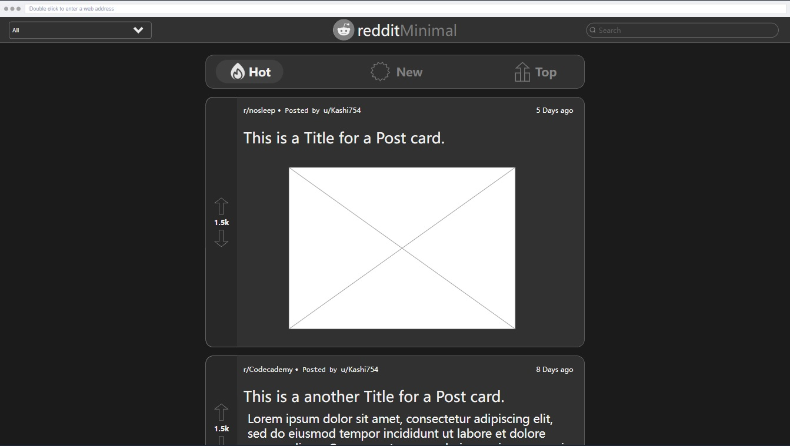

# Reddit Client

A Third-Party Reddit Client using the Reddit JSON api.

## Table of Contents

- [Sitemap](#sitemap)
- [Wireframes](#wireframes)
- [Post Return Types](#post-return-types)
  - [Link](#link-post)
  - [Text](#text-post)
  - [Video](#video-post)
  - [Image](#single-image)
  - [Gallery](#gallery)
- [Comments](#comments)

## Sitemap

```js
  <Root>
    <Index />
    <Subreddits>
      <Subreddit>
        <Post />
      </Subreddit>
    </Subreddits>
    <Users>
      <User />
    </Users>
  </Root>
```

[Back to top](#table-of-contents)

## Wireframes



[Back to top](#table-of-contents)

## Post Return Types

Below is the returned JSON from different types of posts.

### Link Post

```json
{
  "kind": "Listing",
  "data": {
    "selftext": "",
    "after": "t3_16jyj60",
    "dist": 25,
    "children": [
      {
        "kind": "t3",
        "data": {
          "title": "August 2023 Voting Thread",
          "subreddit_name_prefixed": "r/nosleep",
          "ups": 16844,
          "over_18": false,
          "id": "16k14ld",
          "author": "TheCusterWolf",
          "permalink": "/r/nosleep/comments/16foir2/august_2023_voting_thread/",
          "url": "https://old.reddit.com/r/NoSleepOOC/comments/16fm1xc/august_2023_voting_thread/",
          "created_utc": 1694849124,
          "is_video": false
        }
      },
    ],
    "before": null
  }
}
```

If url is an image, need to display image.

[Back to top](#table-of-contents)

### Text Post

```json
[
  {
    "kind": "Listing",
    "data": {
      "after": null,
      "dist": 1,
      "children": [
        {
          "kind": "t3",
          "data": {
            "selftext": "\"They taught you how to deal with pain, but they didn't teach you how to deal with fear,\" he replied as he began pumping carbon dioxide into my bloodstream.",
            "title": "\"You won't get any secrets out of me!\" I told the interrogator.",
            "downs": 0,
            "ups": 2615,
            "score": 2615,
            "selftext_html": "&lt;!-- SC_OFF --&gt;&lt;div class=\"md\"&gt;&lt;p&gt;&amp;quot;They taught you how to deal with pain, but they didn&amp;#39;t teach you how to deal with fear,&amp;quot; he replied as he began pumping carbon dioxide into my bloodstream.&lt;/p&gt;\n&lt;/div&gt;&lt;!-- SC_ON --&gt;",
            "over_18": false,
            "media_only": false,
            "id": "16jkswy",
            "author": "NadaTheMusicMan",
            "num_comments": 68,
            "permalink": "/r/TwoSentenceHorror/comments/16jkswy/you_wont_get_any_secrets_out_of_me_i_told_the/",
            "url": "https://www.reddit.com/r/TwoSentenceHorror/comments/16jkswy/you_wont_get_any_secrets_out_of_me_i_told_the/",
            "created_utc": {
              "value": "1694802161.0n",
              "type": "Big Number"
            },
            "is_video": false
          }
        }
      ],
      "before": null
    }
  }
]
```

[Back to top](#table-of-contents)

### Video Post

```json
{
  "kind": "Listing",
  "data": {
    "after": "t3_16jyj60",
    "dist": 25,
    "children": [
      {
        "kind": "t3",
        "data": {
          "selftext": "Incididunt incididunt sunt velit excepteur sit ipsum deserunt aute ex Lorem adipisicing tempor aliquip. Nulla aute irure incididunt esse in do id aliqua amet. \nLaborum exercitation non velit velit commodo nulla do mollit nostrud occaecat.",
          "title": "Meanwhile in Baune, France",
          "subreddit_name_prefixed": "r/madlads",
          "thumbnail_height": 140,
          "name": "t3_16k14ld",
          "ups": 16844,
          "thumbnail_width": 140,
          "thumbnail": "https://a.thumbs.redditmedia.com/KjevnE_gcwKibMQ9onIqOUqaqwWRwOPrqLXNWHIM3t4.jpg",
          "url_overridden_by_dest": "https://i.redd.it/7xiyoecbkkob1.png",
          "over_18": false,
          "preview": {
            "images": [
              {
                "source": {
                  "url": "https://preview.redd.it/7xiyoecbkkob1.png?auto=webp&amp;s=016ae9560e9b03c0bb45870731bae5f3733598af",
                  "width": 1252,
                  "height": 1554
                },
                "resolutions": [
                  {
                    "url": "https://preview.redd.it/7xiyoecbkkob1.png?width=108&amp;crop=smart&amp;auto=webp&amp;s=c1318495d3ec9bddada562ecd055b5073a18e592",
                    "width": 108,
                    "height": 134
                  },
                ],
                "id": "_QhRRkKxBD3D0naKxlqzAWKc-TlxlnX_4KLBD0U75iQ"
              }
            ],
          },
          "url_overridden_by_dest": "https://old.reddit.com/r/NoSleepOOC/comments/16fm1xc/august_2023_voting_thread/",
          "id": "16k14ld",
          "author": "stepan213",
          "media": {
            "reddit_video": {
            "bitrate_kbps": 2400,
            "fallback_url": "https://v.redd.it/s0i18v0l9gaa1/DASH_720.mp4?source=fallback",
            "height": 720,
            "width": 334,
            "scrubber_media_url": "https://v.redd.it/s0i18v0l9gaa1/DASH_96.mp4",
            "dash_url": "https://v.redd.it/s0i18v0l9gaa1/DASHPlaylist.mpd?a=1697465765%2CZTQwYTFkYjM5NWI4ZGUyOGFmOTAzNDYyNjU4OWU3ZjMzNzkyNjljN2Q2NWYzMjMzZjQwN2Y4ZTM4ZjljNjQwZQ%3D%3D&amp;v=1&amp;f=sd",
            "duration": 58,
            "hls_url": "https://v.redd.it/s0i18v0l9gaa1/HLSPlaylist.m3u8?a=1697465765%2COGY2YjRkMjFlMGVhNTIwZDFjMTVjNjc0OGM5YWViZGQ3MDNmYWJmODAyNTZhZjBkNDQ4Y2MxNDVlMDE1YmYxNQ%3D%3D&amp;v=1&amp;f=sd",
            "is_gif": false,
            "transcoding_status": "completed"
            }
          },
          "permalink": "/r/madlads/comments/16k14ld/meanwhile_in_baune_france/",
          "url": "https://i.redd.it/7xiyoecbkkob1.png",
          "created_utc": 1694849124,
          "is_video": true
        }
      },
    ],
    "before": null
  }
}
```

[Back to top](#table-of-contents)

### Single Image

```json
{
  "kind": "Listing",
  "data": {
    "after": "t3_16jyj60",
    "dist": 25,
    "children": [
      {
        "kind": "t3",
        "data": {
          "selftext": "Incididunt incididunt sunt velit excepteur sit ipsum deserunt aute ex Lorem adipisicing tempor aliquip. Nulla aute irure incididunt esse in do id aliqua amet. \nLaborum exercitation non velit velit commodo nulla do mollit nostrud occaecat.",
          "title": "Meanwhile in Baune, France",
          "subreddit_name_prefixed": "r/madlads",
          "thumbnail_height": 140,
          "name": "t3_16k14ld",
          "ups": 16844,
          "thumbnail_width": 140,
          "thumbnail": "https://a.thumbs.redditmedia.com/KjevnE_gcwKibMQ9onIqOUqaqwWRwOPrqLXNWHIM3t4.jpg",
          "url_overridden_by_dest": "https://i.redd.it/7xiyoecbkkob1.png",
          "over_18": false,
          "preview": {
            "images": [
              {
                "source": {
                  "url": "https://preview.redd.it/7xiyoecbkkob1.png?auto=webp&amp;s=016ae9560e9b03c0bb45870731bae5f3733598af",
                  "width": 1252,
                  "height": 1554
                },
                "resolutions": [
                  {
                    "url": "https://preview.redd.it/7xiyoecbkkob1.png?width=108&amp;crop=smart&amp;auto=webp&amp;s=c1318495d3ec9bddada562ecd055b5073a18e592",
                    "width": 108,
                    "height": 134
                  },
                ],
                "id": "_QhRRkKxBD3D0naKxlqzAWKc-TlxlnX_4KLBD0U75iQ"
              }
            ],
          },
          "url_overridden_by_dest": "https://old.reddit.com/r/NoSleepOOC/comments/16fm1xc/august_2023_voting_thread/",
          "id": "16k14ld",
          "author": "stepan213",
          "media": {
            "reddit_video": {
            "bitrate_kbps": 2400,
            "fallback_url": "https://v.redd.it/s0i18v0l9gaa1/DASH_720.mp4?source=fallback",
            "height": 720,
            "width": 334,
            "scrubber_media_url": "https://v.redd.it/s0i18v0l9gaa1/DASH_96.mp4",
            "dash_url": "https://v.redd.it/s0i18v0l9gaa1/DASHPlaylist.mpd?a=1697465765%2CZTQwYTFkYjM5NWI4ZGUyOGFmOTAzNDYyNjU4OWU3ZjMzNzkyNjljN2Q2NWYzMjMzZjQwN2Y4ZTM4ZjljNjQwZQ%3D%3D&amp;v=1&amp;f=sd",
            "duration": 58,
            "hls_url": "https://v.redd.it/s0i18v0l9gaa1/HLSPlaylist.m3u8?a=1697465765%2COGY2YjRkMjFlMGVhNTIwZDFjMTVjNjc0OGM5YWViZGQ3MDNmYWJmODAyNTZhZjBkNDQ4Y2MxNDVlMDE1YmYxNQ%3D%3D&amp;v=1&amp;f=sd",
            "is_gif": false,
            "transcoding_status": "completed"
            }
          },
          "permalink": "/r/madlads/comments/16k14ld/meanwhile_in_baune_france/",
          "url": "https://i.redd.it/7xiyoecbkkob1.png",
          "created_utc": 1694849124,
          "is_video": false
        }
      },
    ],
    "before": null
  }
}
```

[Back to top](#table-of-contents)

### Gallery

```json
[
  {
    "kind": "Listing",
    "data": {
      "after": null,
      "dist": 1,
      "children": [
        {
          "kind": "t3",
          "data": {
            "selftext": "https://youtu.be/TxmhaSTRav4?si=sDgFEkOBzUn-no6c here is the tutorial I was using PLEASE help me visual studio automatically  made the bullet class internal, and I tried to change it to public and it still doesn't recognize it as a class. I have a date at 5 and I really want to impress her I told her I'd let her play the first game I made please help a man out!! I will PayPal you after I just need help ASAP.",
            "user_reports": [],
            "saved": false,
            "is_gallery": true,
            "title": "I will PayPal you 20 bucks to help me",
            "subreddit_name_prefixed": "r/csharp",
            "thumbnail_height": 140,
            "media_metadata": {
              "k1lxp0ygmgob1": {
                "status": "valid",
                "e": "Image",
                "m": "image/jpg",
                "p": [
                  {
                    "y": 191,
                    "x": 108,
                    "u": "https://preview.redd.it/k1lxp0ygmgob1.jpg?width=108&amp;crop=smart&amp;auto=webp&amp;s=e3b64e12d667ab1788e154785d76190db439dd24"
                  }
                ],
                "s": {
                  "y": 4080,
                  "x": 2296,
                  "u": "https://preview.redd.it/k1lxp0ygmgob1.jpg?width=2296&amp;format=pjpg&amp;auto=webp&amp;s=5ad57f601b7ab667b510ba98866deb3f52152e1f"
                },
                "id": "k1lxp0ygmgob1"
              },
              "m7iqcz8hmgob1": {
                "status": "valid",
                "e": "Image",
                "m": "image/jpg",
                "p": [
                  {
                    "y": 191,
                    "x": 108,
                    "u": "https://preview.redd.it/m7iqcz8hmgob1.jpg?width=108&amp;crop=smart&amp;auto=webp&amp;s=ccae84abe2a953fe9b237925964d08c26aacebbc"
                  }
                ],
                "s": {
                  "y": 4080,
                  "x": 2296,
                  "u": "https://preview.redd.it/m7iqcz8hmgob1.jpg?width=2296&amp;format=pjpg&amp;auto=webp&amp;s=7f0aa8cab53c2888eb89a0d454a7efd532b02cfb"
                },
                "id": "m7iqcz8hmgob1"
              }
            },
            "upvote_ratio": 0.27,
            "ups": 0,
            "gallery_data": {
              "items": [
                {
                  "media_id": "k1lxp0ygmgob1",
                  "id": 329961278
                },
                {
                  "media_id": "m7iqcz8hmgob1",
                  "id": 329961279
                },
              ]
            },
            "score": 0,
            "thumbnail": "https://b.thumbs.redditmedia.com/LvcGt1WQEz86HIzbBTZWkKSylCjpp9-uuyy_LJponLA.jpg",
            "selftext_html": "&lt;!-- SC_OFF --&gt;&lt;div class=\"md\"&gt;&lt;p&gt;&lt;a href=\"https://youtu.be/TxmhaSTRav4?si=sDgFEkOBzUn-no6c\"&gt;https://youtu.be/TxmhaSTRav4?si=sDgFEkOBzUn-no6c&lt;/a&gt; here is the tutorial I was using PLEASE help me visual studio automatically  made the bullet class internal, and I tried to change it to public and it still doesn&amp;#39;t recognize it as a class. I have a date at 5 and I really want to impress her I told her I&amp;#39;d let her play the first game I made please help a man out!! I will PayPal you after I just need help ASAP.&lt;/p&gt;\n&lt;/div&gt;&lt;!-- SC_ON --&gt;",
            "url_overridden_by_dest": "https://www.reddit.com/gallery/16jkh1e",
            "over_18": false,
            "media_only": false,
            "id": "16jkh1e",
            "author": "Glittering-Ad-3246",
            "num_comments": 79,
            "permalink": "/r/csharp/comments/16jkh1e/i_will_paypal_you_20_bucks_to_help_me/",
            "url": "https://www.reddit.com/gallery/16jkh1e",
            "created_utc": {
              "value": "1694801333.0n",
              "type": "Big Number"
            },
            "is_video": false
          }
        }
      ],
      "before": null
    }
  }
]
```

[Back to top](#table-of-contents)

## Comments

```json
[ {"...post from above"},
  {
    "kind": "Listing",
    "data": {
      "after": null,
      "dist": null,
      "children": [
        {
          "kind": "t1",
          "data": {
            "subreddit_id": "t5_3aegn",
            "comment_type": null,
            "author_flair_type": "text",
            "likes": null,
            "replies": {
              "kind": "Listing",
              "data": {
                "after": null,
                "dist": null,
                "children": [
                  {
                    "kind": "t1",
                    "data": {
                      "subreddit_id": "t5_3aegn",
                      "author_is_blocked": false,
                      "comment_type": null,
                      "author_flair_type": "text",
                      "subreddit": "madlads",
                      "likes": null,
                      "replies": {
                        "kind": "Listing"
                      },
                      "id": "k0taesx",
                      "author": "shitmykidsays",
                      "created_utc": {
                        "value": "1694853299.0n",
                        "type": "Big Number"
                      },
                      "parent_id": "t1_k0t78uw",
                      "score": 581,
                      "body": "Lanes are just a suggestion in most places there anyway.",
                      "downs": 0,
                      "body_html": "<div class=\"md\"><p>Lanes are just a suggestion in most places there anyway.</p>\n</div>",
                      "ups": 581
                    }
                  }
                ],
                "before": null
              }
            },
            "id": "k0t78uw",
            "author": "benderbender42",
            "created_utc": {
              "value": "1694850768.0n",
              "type": "Big Number"
            },
            "parent_id": "t3_16k14ld",
            "score": 1789,
            "body": "I'd love to see the stats after a year, if this works or just causes more accidents",
            "downs": 0,
            "body_html": "<div class=\"md\"><p>I&#39;d love to see the stats after a year, if this works or just causes more accidents</p>\n</div>",
            "ups": 1789
          }
        },
        {
          "kind": "more",
          "data": {
            "count": 257,
            "name": "t1_k0tve4c",
            "id": "k0tve4c",
            "parent_id": "t3_16k14ld",
            "depth": 0,
            "children": [
              "k0tve4c",
              "..."
            ]
          }
        }
      ],
      "before": null
    }
  }
]
```

[Back to top](#table-of-contents)

### `npm run build`

Builds the app for production to the `build` folder.\
It correctly bundles React in production mode and optimizes the build for the best performance.

The build is minified and the filenames include the hashes.\
Your app is ready to be deployed!

See the section about [deployment](https://facebook.github.io/create-react-app/docs/deployment) for more information.

### `npm run eject`

**Note: this is a one-way operation. Once you `eject`, you can't go back!**

If you aren't satisfied with the build tool and configuration choices, you can `eject` at any time. This command will remove the single build dependency from your project.

Instead, it will copy all the configuration files and the transitive dependencies (webpack, Babel, ESLint, etc) right into your project so you have full control over them. All of the commands except `eject` will still work, but they will point to the copied scripts so you can tweak them. At this point you're on your own.

You don't have to ever use `eject`. The curated feature set is suitable for small and middle deployments, and you shouldn't feel obligated to use this feature. However we understand that this tool wouldn't be useful if you couldn't customize it when you are ready for it.

## Learn More

You can learn more in the [Create React App documentation](https://facebook.github.io/create-react-app/docs/getting-started).

To learn React, check out the [React documentation](https://reactjs.org/).
